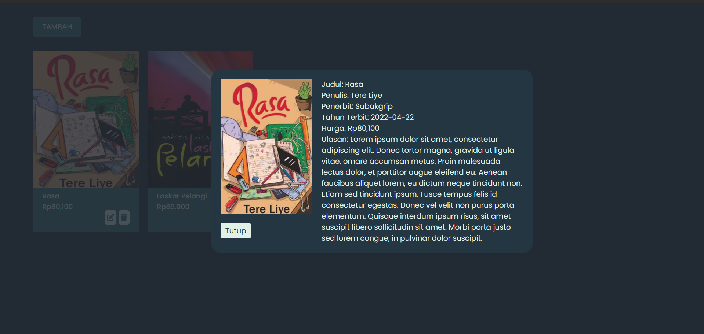
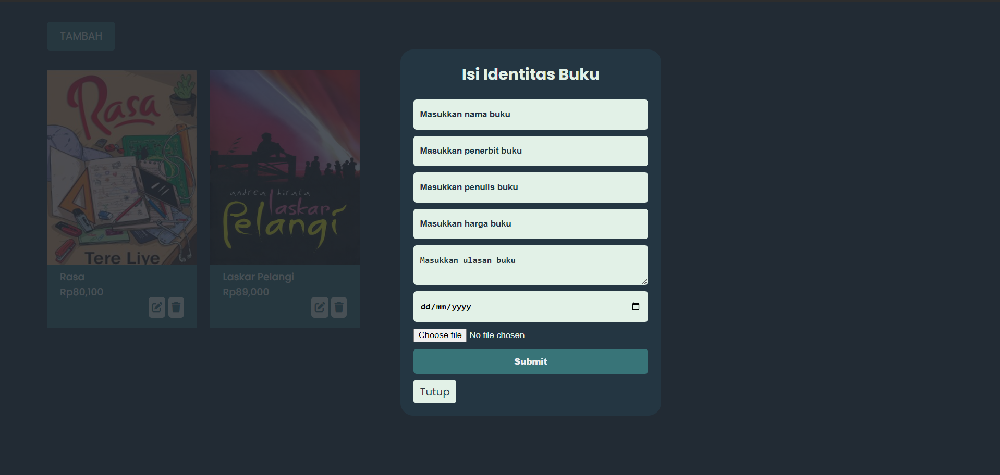
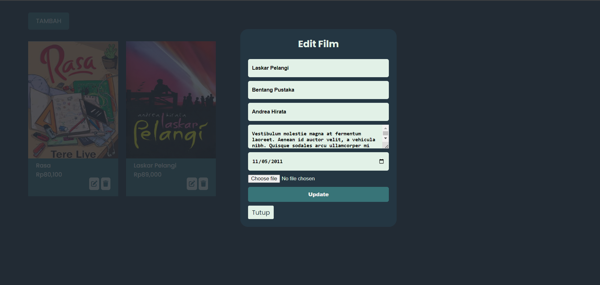

# APLIKASI REVIEW BUKU

## Deskripsi

Ini adalah aplikasi web berbasis PHP sederhana untuk mengelola review buku. Pengguna dapat menambah, melihat, mengedit, dan menghapus review buku, termasuk detail seperti judul, penulis, penerbit, harga, dan gambar sampul buku.

## Fitur

- Menambahkan Buku: Pengguna dapat menambahkan buku baru dengan judul, penulis, penerbit, harga, ulasan, tahun terbit, dan gambar sampul.
- Edit Buku: Pengguna dapat mengedit data buku yang sudah ditambahkan.
- Hapus Buku: Pengguna dapat menghapus buku dari daftar.
- Lihat Detail Buku: Pengguna dapat melihat detail lengkap dari setiap buku.
- Daftar Buku: Menampilkan daftar buku yang ditambahkan, beserta informasi singkatnya.
- Upload Gambar Sampul: Mendukung upload gambar sampul buku.

## Penggunaan

1. Menambahkan Buku: Klik tombol TAMBAH, isi formulir dengan judul buku, penulis, penerbit, harga, ulasan, tahun terbit, dan unggah gambar sampul.
1. Mengedit Buku: Pada daftar buku, klik ikon pensil pada buku yang ingin diubah.
1. Menghapus Buku: Klik ikon tempat sampah pada buku yang ingin dihapus.
1. Melihat Detail Buku: Klik pada buku untuk melihat informasi lengkapnya.

## Teknologi yang Digunakan

- PHP
- SQLite3
- HTML
- CSS
- Font Awesome

---

> **JIKA ADA KESALAHAN, BUG, DAN FITUR BARU BERIKAN KOMENTAR KALIAN DI ``` ISSUES ``` TAB**




